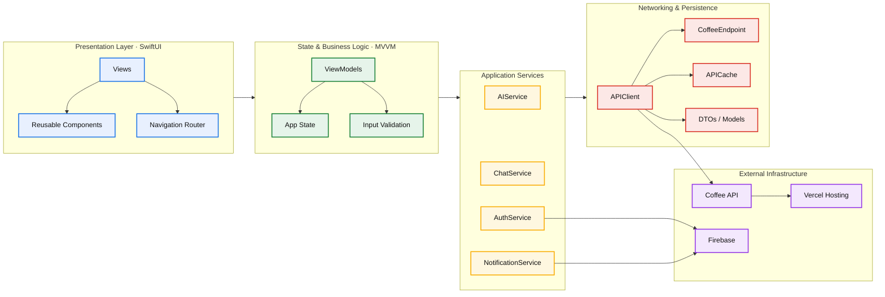

# The Casa App - Barista AI Coffee Experience

**The Casa App** es una aplicación de iOS moderna construida con **SwiftUI** que redefine la experiencia de pedir café. Integra Inteligencia Artificial avanzada para actuar como un Barista digital, ofreciendo recomendaciones personalizadas y asistencia en tiempo real a través de una interfaz de chat fluida.

## 🚀 Requisitos Previos

Para ejecutar y desarrollar este proyecto, asegúrate de contar con:

- **Xcode 14.0+**
- **iOS 15.0+**
- **Swift 5.5+**
- Una cuenta de **Firebase** (para autenticación y notificaciones push)

## 🛠️ Configuración y Archivos Requeridos

### 1. Firebase (GoogleService-Info.plist)

El proyecto utiliza Firebase para la gestión de usuarios y notificaciones. Debes descargar el archivo `GoogleService-Info.plist` desde tu consola de Firebase y colocarlo en la raíz del folder `The-Casa-App/`.

### 2. Configuración de la App (AppConfig.swift)

El archivo `The-Casa-App/Services/AppConfig.swift` centraliza la configuración del entorno.

```swift
enum AppEnvironment {
    case local       // http://localhost:8000
    case production  // https://the-casa-coffee-api.vercel.app
}

struct AppConfig {
    static let environment: AppEnvironment = .production
    static let apiVersion = "/api/v1"
    static let firebaseApiKey = "TU_FIREBASE_API_KEY"
}
```

## 🖥️ Backend & Infraestructura

La aplicación iOS se comunica con una API moderna y escalable que gestiona la lógica de negocio, la persistencia y la inteligencia artificial.

[](https://www.python.org/)
[](https://fastapi.tiangolo.com/)
[](https://sqlmodel.tiangolo.com/)
[](https://firebase.google.com/)
[](https://supabase.com/)

### Características Técnicas del Backend:
- **IA Avanzada:** Integración con **Groq (Llama 3.1)** para el Barista AI y recomendaciones personalizadas.
- **Arquitectura:** Basada en capas (Routers, Services, Repositories) para máxima mantenibilidad.
- **Persistencia:** **PostgreSQL** alojado en **Supabase** usando **SQLModel** para validación de datos.
- **Seguridad:** Validación de tokens y sincronización de perfiles mediante **Firebase Admin SDK**.
- **Despliegue:** API preparada para alta disponibilidad y optimizada para tiempos de respuesta sub-segundo.

> 🔗 **Repositorio Backend:** [the-casa-coffee-api](https://github.com/amnotwallas/the-casa-coffee-api.git)

## 🏗️ Arquitectura del Proyecto

La aplicación sigue el patrón de diseño **MVVM (Model-View-ViewModel)** para mantener una separación de responsabilidades clara y facilitar la testabilidad.



## 🤖 Agentes de Inteligencia Artificial

### 1. Agente de Consulta (Barista AI)

El **Barista AI** es el corazón de la interacción en la app. Proporciona asistencia interactiva y respuestas a dudas sobre el menú o el proceso de compra.

- **Endpoint:** `/chat/message` (POST)
- **Tecnología:** Utiliza **Server-Sent Events (SSE)** para una experiencia de "streaming". Esto permite que el usuario vea cómo se genera la respuesta palabra por palabra, similar a ChatGPT.
- **Implementación:** `ChatService` maneja la conexión `URLSessionDataDelegate` para procesar los fragmentos (chunks) de texto y metadatos (como sugerencias de respuesta) que llegan del servidor.

### 2. Agente de Recomendaciones

Este agente analiza el contexto del usuario y las tendencias para ofrecer productos que encajen con sus gustos.

- **Endpoint:** `/chat/welcome` (GET)
- **Funcionamiento:** Se invoca al inicio de la sesión o en la pantalla de bienvenida. El backend devuelve un `WelcomeResponse` que incluye un mensaje de saludo dinámico y una lista de `Product` recomendados.
- **Implementación:** `AIService` gestiona la obtención de estas recomendaciones iniciales para poblar la vista principal con opciones atractivas desde el primer momento.

## 📦 Gestión de Dependencias

El proyecto utiliza **Swift Package Manager (SPM)** para gestionar librerías externas como:

- Firebase SDK (Auth, Messaging, Analytics)
- SDWebImageSwiftUI (para la carga eficiente de imágenes)

## 🔗 Repositorios Relacionados

- **Backend API:** [the-casa-coffee-api](https://github.com/amnotwallas/the-casa-coffee-api.git) - Repositorio de la API que alimenta esta aplicación.

---

_Desarrollado para ofrecer la mejor experiencia cafetera impulsada por IA._
